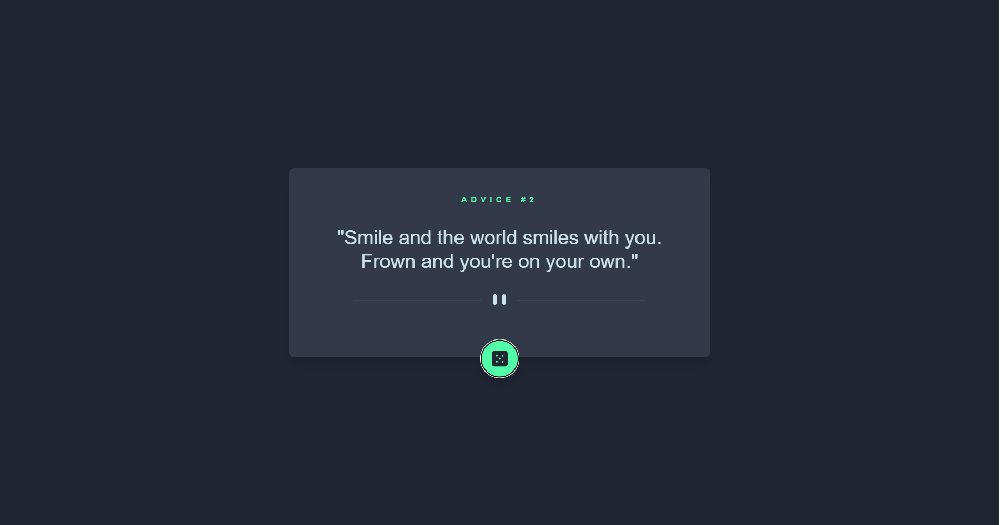
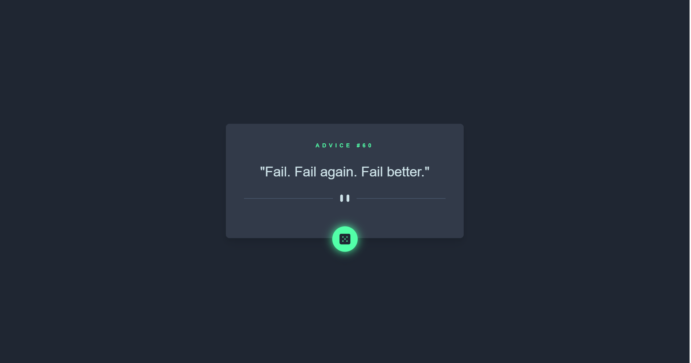

# Frontend Mentor - Advice generator app solution

This is a solution to the [Advice generator app challenge on Frontend Mentor](https://www.frontendmentor.io/challenges/advice-generator-app-QdUG-13db). Frontend Mentor challenges help you improve your coding skills by building realistic projects.

## Table of contents

- [Overview](#overview)
  - [The challenge](#the-challenge)
  - [Screenshot](#screenshot)
  - [Links](#links)
- [My process](#my-process)
  - [Built with](#built-with)
  - [Continued development](#continued-development)
- [Author](#author)

## Overview

### The challenge

Users should be able to:

- View the optimal layout for the app depending on their device's screen size
- See hover states for all interactive elements on the page
- Generate a new piece of advice by clicking the dice icon

### Screenshot

### Links

- Solution URL: [Solution](https://github.com/iqbalzayn01/my-challenges/tree/challenge-2)
- Live Site URL: [Live Site](https://advice-generator-app2.netlify.app/)

## My process

### Built with

- [Tailwindcss](https://tailwindcss.com/) - For styles
- [Advice Slip](https://api.adviceslip.com/) - For API
- CSS custom properties
- Flexbox
- Mobile-first workflow

### Continued development

I plan to continue developing the Advice Generator App in the future, focusing on enhancing its features and improving its user interface for a better user experience.

## Author

- Frontend Mentor - [@iqbalzayyan](https://www.frontendmentor.io/profile/iqbalzayyan)
- Twitter - [@iqbalzayn01](https://www.twitter.com/iqbalzayn01)
